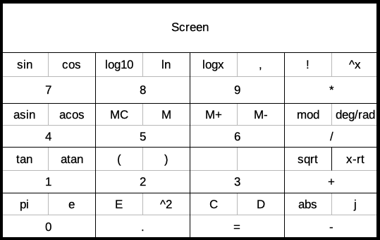

# Calculux
Thanks for taking an interest in the Calculator Delux project! If you find it useful or just like the project, I'd appreciate a star!

This is a small project I started because current desktop calculator apps were not suitable for what I wanted. I wanted to be able to use the large majority of the calculator functions from my keyboard, but most existing apps relegate any functions beyond basic arithmetic to buttons that are not accessible from the keyboard. Calculux intends to solve that!

The plan for this project in the longer term is to expand the functionality beyond normal math functions and provide additional features such as unit conversions, data and time calculations, as well as arithmetic in, and conversion to, alternative bases.

Here is the idea for the project that I am currently working towards:

Short term features that I plan to implement include:
- Second and Third functions for most buttons (things like powers, roots, trig, etc)
- Edit arbitrary areas of the display and navigate with arrow keys instead only being able to edit the right-most character
- Improve the looks from the widget defaults!

This project is written in Python and uses Qt through PyQt5 for the GUI. If you are interested in contributing, I'm always open to pull requests.
