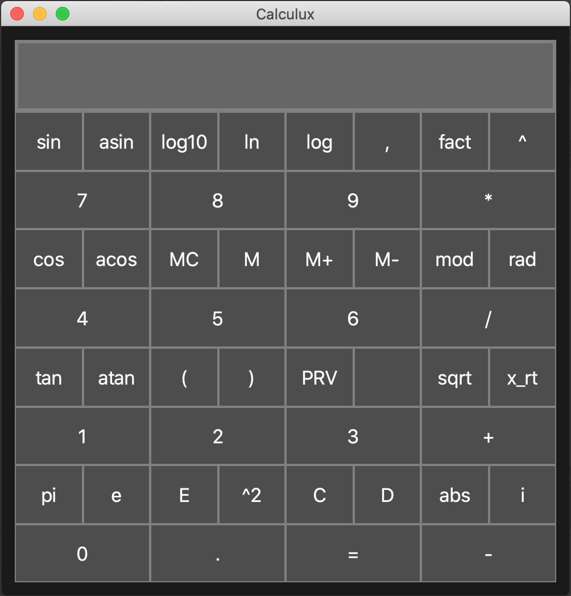

# Calculux
Thanks for taking an interest in the Calculator Delux project! If you find it useful or just like the project, feel free to star this repo on GitHub!

## Usage
The beauty of Calculux is that every button can be accessed with the numpad and Alt or Ctrl (Windows) or Command (Mac) keys! For each set of three buttons, the main button is that key by itself, and the second and third functions are used with the Alt or Ctrl/Command keys.

## Notice
The current version is v0-alpha. This means there are probably bugs that are yet to be found, including ones that could potentially produce misleading math results. See LICENSE sections 15 to 17 for more information.

## About
This is a small project I started because current desktop calculator apps did not provide the features I wanted. I wanted to be able to use the large majority of the calculator functions from my keyboard, but most existing apps relegate any functions beyond basic arithmetic to buttons that are not accessible from the keyboard. Calculux intends to solve that!

The plan for this project in the longer term is to expand the functionality beyond normal math functions and provide additional features such as unit conversions, data and time calculations, as well as arithmetic in, and conversion to, alternative bases.

Checkout what the project looks like right now!

Short term features that I plan to implement include:
- Be able to switch between radians and degrees, currently radians is the only option
- Edit arbitrary areas of the display and navigate with arrow keys instead only being able to edit the right-most character
- Have one display for the expression and one display for the result
- map multiple keys that have the same function to the main key for that function
- Longer history instead of just one previous result
- Saving setting between sessions (e.g. history, rad or deg setting, etc)
- Documentation on how to use certain functions that are a bit out of the ordinary (e.g. mod, log, x_rt, etc)

This project is written in Python and uses Qt through PyQt5 for the GUI. If you are interested in contributing, I'm always open to pull requests. If you notice a bug, please open an issue, or fix it and submit a pull request.
